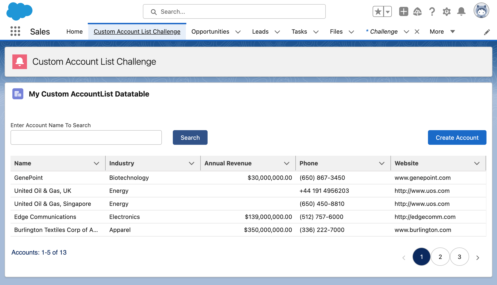

# salesforce-lwc-challenge
Created a "AccountList" Lightning Web Component to display a list of Accounts with sorting, pagination, and search functionality. Ensured responsiveness and SLDS adherence, implemented error handling, and provided a button to create new Account records. Demonstrated its compatibility with Lightning page, experience cloud page, and community page.

<h2 align="center">Overview of the Account List App</h2>

<h2 align="center"> Implemented a search functionality to filter the list of accounts based on account name.</h2>
                  
                  

<h2 align="center"> Implemented pagination with the ability to navigate between pages.</h2>
                   

<h2 align="center"> Implement sorting functionality on each column of the table.</h2>
 
                  
<h2 align="center"> Added a button to create a new Account record.</h2>
                   

